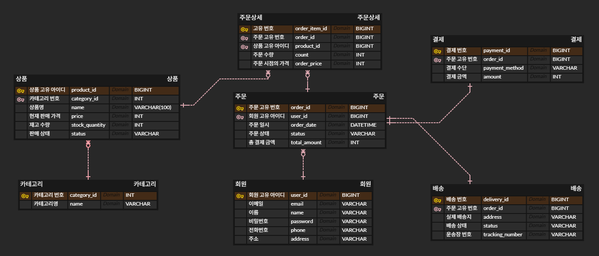

# 🛍️ Online Shopping Mall Database Design

> **이커머스 서비스의 전체 데이터 라이프사이클(회원~배송)을 고려한 RDBMS 모델링 프로젝트**

## 1. 프로젝트 개요
* **Type:** 개인 프로젝트 (Individual)
* **Focus:** 정규화(Normalization), 데이터 무결성, 비즈니스 로직 구현
* **Database:** MySQL
* **Tools:** ERD Cloud

---

## 2. ERD (Entity Relationship Diagram)

*(위 이미지는 다크 모드 환경에서 설계되었습니다.)*

---

## 3. 핵심 설계 의도 (Design Key Points)

### A. N:M 관계 해소 (Normalization)
`주문(Orders)`과 `상품(Products)`은 다대다 관계입니다. 이를 물리적 모델링 단계에서 구현하기 위해 `주문상세(Order_Items)`라는 교차 테이블(Mapping Table)을 도출하여 **제1정규화**를 준수했습니다.

### B. 가격 이력 관리 (Data Integrity)
쇼핑몰 특성상 상품의 가격(`Products.price`)은 수시로 변동될 수 있습니다.
하지만 고객이 이미 결제한 과거 주문 내역의 가격이 변동되어서는 안 됩니다.
따라서, **주문이 생성되는 시점의 가격**을 `Order_Items.order_price` 컬럼에 별도로 **스냅샷(Snapshot)** 형태로 저장하여 데이터의 무결성을 보장했습니다.

### C. 확장성을 고려한 테이블 분리
`결제(Payments)`와 `배송(Deliveries)` 정보를 `주문(Orders)` 테이블에 합치지 않고 **1:1 관계**로 분리했습니다.
이는 추후 **부분 취소, 배송지 변경, 다중 배송** 등 비즈니스 로직이 확장될 때 유연하게 대처하기 위함입니다.

---

## 4. 주요 데이터 분석 시나리오 (Analytics)
단순 저장을 넘어, 비즈니스 인사이트를 도출하기 위한 쿼리를 고려하여 설계했습니다.

* **매출 분석:** `GROUP BY`와 `JOIN`을 활용하여 카테고리별/기간별 총 매출액 집계
* **우수 고객 관리:** 최근 3개월간 구매 금액 총합(`SUM`)이 높은 VIP 회원 추출
* **재고 모니터링:** `WHERE stock_quantity < 10` 조건을 통해 품절 임박 상품 실시간 조회

---

## 5. 적용된 SQL (DDL)
> 상세 코드는 [`schema.sql`](./schema.sql) 파일에서 확인하실 수 있습니다.

```sql
-- 주문 상세 (Order_Items) 테이블 예시
CREATE TABLE Order_Items (
    order_item_id BIGINT AUTO_INCREMENT PRIMARY KEY,
    order_id BIGINT NOT NULL,
    product_id BIGINT NOT NULL,
    count INT NOT NULL, 
    order_price INT NOT NULL, -- 핵심: 주문 시점의 가격 저장
    FOREIGN KEY (order_id) REFERENCES Orders(order_id),
    FOREIGN KEY (product_id) REFERENCES Products(product_id)
);
